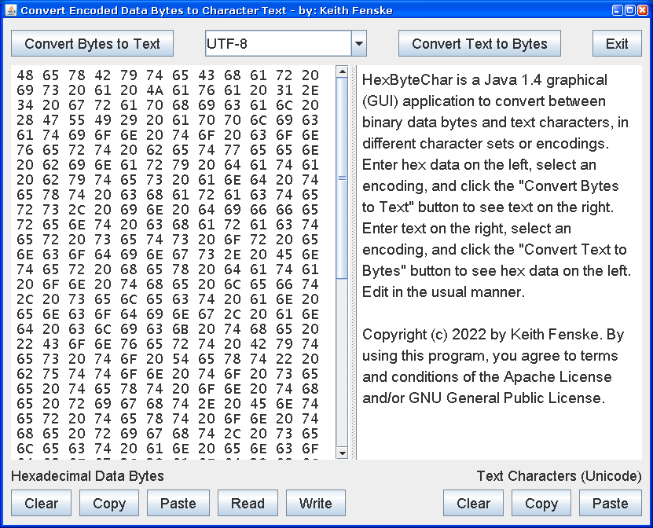

### Hex Byte Char (Java)

by: Keith Fenske, https://kwfenske.github.io/

HexByteChar is a Java 1.4 graphical (GUI) application to convert between binary
data bytes and text characters, in different character sets or encodings.
Please refer to the following web page:

> https://en.wikipedia.org/wiki/Character_encoding

Data bytes are shown in hexadecimal on the left side of a split screen. Text
characters are shown on the right as per the Unicode standard. You may enter
hex data on the left, select an encoding, and click the "Convert Bytes to Text"
button to see text on the right. You may enter text on the right, select an
encoding, and click the "Convert Text to Bytes" button to see hex data on the
left. Edit in the usual manner. The hex display looks best with the "Lucida
Console" font installed.

This program was originally written to identify strange UTF-8 characters in
e-mail messages. Success was mixed because of the number of steps required:
copy and paste unknown characters as text, convert text to data bytes using the
system's default encoding, convert bytes back to text as UTF-8, convert text
again as UTF-16 or UTF-32, and look up resulting byte codes to identify Unicode
characters. (See any "Character Map" application.) A single button to do this
would be more convenient but much too specialized. The strange character was
often "U+FEFF zero width no-break space" encoded as 0xEF 0xBB 0xBF, also known
as a byte-order mark.

Download the ZIP file here: https://kwfenske.github.io/hex-byte-char-java.zip

Released under the terms and conditions of the Apache License (version 2.0 or
later) and/or the GNU General Public License (GPL, version 2 or later).

